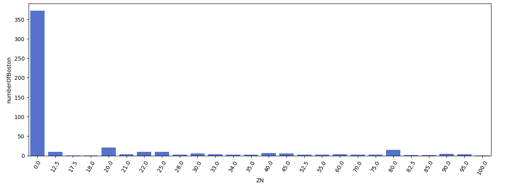

# Laporan Proyek Machine Learning
### Nama : Annisa Mustika Anggraeni
### Nim : 211351020
### Kelas : IF Pagi A

## Domain Proyek
Dalam proyek ini kita dapat mengetahui estimasi harga rumah di Boston, dengan mengembangkan model prediksi harga pajak properti rumah berdasarkan faktor-faktor seperti proporsi hektar, proporsi hektar, jumlah rata-rata kamar, dll. Ini adalah proyek pemodelan machine learning yang bisa membantu orang memahami perkiraan harga rumah di masa depan.

## Business Understanding
Dapat membantu kita untuk memudahkan mengetahui harga tarif pajak rumah yang ada di Boston tanpa harus datang ketempatnya langsung dan juga menghemat biaya.

Bagian laporan ini mencakup:

### Problem Statements
Bagaimana kita mengetahui tarif pajak properti rumah di boston dengan mudah tanpa harus mengeluarkan biaya besar

### Goals
Memastikan bahwa perhitungan tarif pajak properti rumah mengikuti prinsip keadilan, sehingga pemilik rumah dengan nilai properti yang sebanding membayar jumlah pajak yang sebanding pula.

### Solution Statements
- Dengan menggunakan pengembangan platform berbasis web untuk mengetahui tarif harga pajak ini memudahkan pengguna untuk mengakses dengan cepat dan mudah.
- Mengembangkan model machine learning dengan menggunakan metode Regresi Linear.

### Data Understanding
Data ini menggunakan dataset yang berasal dari kaggle yang berisi harga rumah di boston. terdiri dari 506 baris dan 14 kolom, yang mencakup berbagai variabel yang berkaitan dengan harga pajak properti rumah di Boston.

(https://www.kaggle.com/datasets/arunjathari/bostonhousepricedata/code)

### Variabel - variabel pada Boston House Prices adalah sebagai berikut :
- CRIM: tingkat kejahatan per kapita menurut kota
- ZN: proporsi lahan perumahan yang dikategorikan untuk lot lebih dari 25.000 sq.ft.
- INDUS: proporsi hektar bisnis non-ritel per kota
- CHAS: variabel dummy Sungai Charles (1 jika saluran membatasi sungai; 0 sebaliknya) 
- NOX: konsentrasi oksida nitrat (bagian per 10 juta) [bagian / 10M]
- RM: jumlah rata-rata kamar per tempat tinggal
- AGE: proporsi unit yang ditempati pemilik yang dibangun sebelum 1940
- DIS: jarak tertimbang ke lima pusat
pekerjaan Boston
- RAD: indeks aksesibilitas ke jalan raya radial 
- TAX: tarif pajak properti bernilai penuh 
- PTRATIO: rasio murid-guru menurut kota 
- B: Hasil persamaan B = 1000 (Bk - 0,63) ^ 2 di mana Bk adalah proporsi orang kulit hitam menurut kota
- LSTAT: % status populasi yang lebih rendah
Variabel output: 
- MEDV:
Nilai rata-rata rumah yang ditempati pemilik di Boston

## Data Preparation
### Data Collection
Untuk data yang saya gunakan menggunakan dataset dengan nama Boston house price data  yang didapat dari website kaggle.

### Data Discovery and Profiling
Pertama-tama kita disini akan menggunakan google colab untuk mengerjakannya maka kita akan import file lalu mengupload token kaggle kita agar nanti bisa mendownload dataset dari kaggle melalui dataset dari kaggle melalui google colab,
```python
from google.colab import files
files.upload()
```
Selanjutnya setelah kita menggupload filenya, maka kita akan lanjut dengan membuat sebuah folder untuk menyimpan file kaggle.json yang sudah diupload tadi.

```python
#make directory and change permission
!mkdir -p ~/.kaggle
!cp kaggle.json ~/.kaggle/
!chmod 600 ~/.kaggle/kaggle.json
!ls ~/.kaggle
```
Tahap berikutnya kita akan memanggil url dataset yang sudah ada di website kaggle untuk didownload ke google colab.
```python
!kaggle datasets download -d arunjathari/bostonhousepricedata
```
Nah, jika berhasil selanjutnya kita akan ekstrak dataset yang sudah kita download.
```python
!mkdir bostonhousepricedata
!unzip bostonhousepricedata.zip -d bostonhousepricedata
!ls bostonhousepricedata
```
Untuk bagian ini kita akan menggunakan teknik EDA. Yang kita harus lakukan adalah dengan mengimport semua library yang dibutuhkan.
```python
import pandas as pd
import numpy as np
import matplotlib.pyplot as plt
import seaborn as sns
from sklearn.model_selection import train_test_split
from sklearn.linear_model import LinearRegression
```
Lalu panggil dataset file csv yang telah diekstrak pada sebuah variable.
```python
df = pd.read_csv('bostonhousepricedata/Boston-house-price-data.csv')
```
Lalu mari kita lihat dataset kita.
```python
df.head()
```
Lalu kita juga bisa melihat berapa baris dan kolom yang ada di dataset kita.
```python
df.shape
```
Selanjutnya untuk melihat mengenai type data dari masing-masing kolom kita bisa menggunakan property info.
```python
df.info()
```
Lalu kita akan memeriksa apakah dataset tersebut terdapat baris yang kosong atau null dengan menggunkan seaborn.
```python
sns.heatmap(df.isnull())
```


Nah,kita bisa lihat hasil nya cukup aman.

Mari kita lanjutkan untuk mengecek detail informasi dari dataset ini.
```python
df.describe()
```
Setelah itu mari kita gambarkan visualisasi heatmap untuk melihat seaborn data pada dataset.
```python
plt.figure(figsize=(10,8))
sns.heatmap(df.corr(),annot=True)
```


Lalu mari kita tampilkan proporsi lahan berdasarkan proporsi hektar.
```python
ZN = df.groupby('ZN').count()[['INDUS']].sort_values(by='INDUS',ascending=True).reset_index()
ZN = ZN.rename(columns={'INDUS':'numberOfBoston'})
```
```python
fig = plt.figure(figsize=(15,5))
sns.barplot(x=ZN['ZN'], y=ZN['numberOfBoston'], color='royalblue')
plt.xticks(rotation=60)
```

Lalu kita coba tampilkan jumlah rata-rata kamar berdarkan tarif pajak properti.
```python
RM = df.groupby('RM').count()[['TAX']].sort_values(by='TAX').reset_index()
RM = RM.rename(columns={'TAX':'count'})
```
```python
plt.figure(figsize=(15,5))
sns.barplot(x=RM ['RM'], y=RM ['count'], color='royalblue')
```

Selanjutnya kita coba tampilkan distribusi dari proporsi lahan.
```python
plt.figure(figsize=(15,5))
sns.displot(df['ZN'])
```


lanjut kita coba tampilkan distribusi dari jarak rumah ke lima pusat pekerjaan di boston.
```python
plt.figure(figsize=(15,5))
sns.displot(df['DIS'])
```


Nah disini kita berhasil melakukan plotdataset, mendiskripsika dataset dan memberikan informasi melalui dari grafik.

Selanjut mari kita lanjut kedalam modeling.
## Modeling
Selanjutnya kita menyeleksi fitur terlebih dahulu yang ada dari dataset untuk dijadikan fitur dan kolom apa yang akan dijadikan targer.
```python
features = ['CRIM',	'ZN',	'INDUS', 'NOX',	'RM',	'AGE',	'DIS', 'PTRATIO']
x = df[features]
y = df['TAX']
x.shape, y.shape
```
Lanjut berikutnya kita akan split data training dan data testingnya.
```python
# x = fitur  y = target
from sklearn.model_selection import train_test_split
x_train, x_test, y_train, y_test = train_test_split(x,y,random_state=82)
y_test.shape
```
Setelah berhasil kita lanjutkan kembali untuk membuat model regresi linear.
```python
from sklearn.linear_model import LinearRegression
lr = LinearRegression()
lr.fit(x_train,y_train)
pred = lr.predict(x_test)
```
Jika berhasil kita akan melihat akurasinya.
```python
score = lr.score(x_test, y_test)
print('pajak properti rumah di boston = ', score)
```


Bisa kita lihat akurasi model regresi yang kita dapatkan yaitu 72.73%.

Lalu kita akan membuat inputan model regresi linear.
```python
input_data = np.array([[0.00632, 18.0, 2.31, 0.538,	6.575, 65.2, 4.0900, 15.3]])

prediction = lr.predict(input_data)
print('Estimasi harga pajak rumah dalam USA :', prediction)
```
Jika berhasil kita akan lanjut untuk menyimpan model yang telah kita buat tadi.
```python
import pickle
filename = 'Tarif_Pajak_diBoston.sav'
pickle.dump(lr,open(filename,'wb'))
```
## Evaluation
Disini saya menggunakan R-squared (R²) sebagai evaluasi.
- R-squared (R²) digunakan untuk mengevaluasi sejauh mana model regresi cocok dengan data yang diamati. Lebih spesifik, R-squared memberikan informasi tentang proporsi variabilitas dalam variabel dependen (output) yang dapat dijelaskan oleh variabel independen (input) dalam model regresi.
  


Di sini : R-squared (R²) adalah koefisien determinasi.
SSR (Sum of Squares Residual) adalah jumlah kuadrat residual, yang merupakan jumlah kuadrat selisih antara nilai yang diprediksi oleh model dan nilai sebenarnya dalam data.
SST (Sum of Squares Total) adalah jumlah kuadrat total, yang merupakan jumlah kuadrat selisih antara nilai data asli dan nilai rata-rata data.


```python
from sklearn.metrics import r2_score

features = ['CRIM',	'ZN',	'INDUS', 'NOX',	'RM',	'AGE',	'DIS', 'PTRATIO']
x = df[features]
y = df['TAX']

model = LinearRegression()
model.fit(x, y)

#Melakukan prediksi menggunakan model
y_pred = model.predict(x)
r_squared = r2_score(y, y_pred)

#Menampilkan R-squared
print("Skor Akurasi (R-squared):", r_squared)
```


## Deployment
https://appbostonhouseprice.streamlit.app


