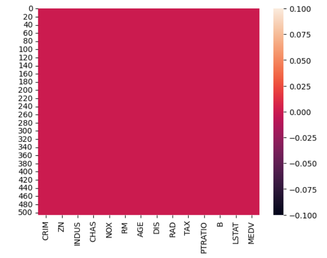
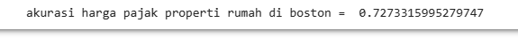

# Laporan Proyek Machine Learning
### Nama  : Annisa Mustika Anggraeni
### Nim   : 211351020
### Kelas : Teknik Informatika Pagi A

### Domain Proyek
 Breast Cancer ini data yang berupa karakteristik inti sel kanker dan diagnosis kanker payudara. Pada projek test prediksi kanker payudara ini diharapkan dapat memudahkan pekerjaan dokter dalam mengindetifikasi penyakit kanker ganas atau jinak lebih awal.

### Business Understanding
Data diagnosis kanker payudara sangat penting untuk memastikan bahwa proses diagnosis berjalan efisien, akurat, dan sesuai dengan standar medis. Ini juga membantu organisasi kesehatan untuk terus meningkatkan layanan mereka dan memberikan perhatian yang tepat kepada pasien dengan kanker payudara.

Bagian laporan ini mencakup :

### Problem Statements
Bagaimana kita dapat mengurangi ketidakpastian dalam hal biopsi jaringan payudara untuk meningkatkan tingkat kepastian diagnosis kanker payudara.

### Goals
Meningkatkan ketepatan diagnosis kanker melalui biopsi jaringan payudara,sehingga tingkat kesalahan diagnosis sedikit berkurang.

### Solution Statements

- Dengan menggunakan pengembangan platform diagnosis kanker payudara  yang berbasis web ini, yang mengintegrasikan data dari kaggle.com menjadi solusi agar kita dapat mengetahui diagnosis kanker payudara dengan memudahkan kita mendeteksi diagnosis kanker payudara, baik ganas (kanker payudara maligna) atau jinak (benigna), dan juga melibatkan serangkaian langkah dan prosedur medis.

- Mendorong kerja sama antara ahli patologi, ahli radiologi, dan ahli klinis dalam tim diagnostik untuk mendiskusikan kasus-kasus yang kompleks dan meningkatkan akurasi diagnosa.

## Data Understanding
Dataset yang saya gunakan diambil dari kaggle yang berisi tentang informasi berupa Fitur yang dihitung dari gambar digital aspirasi jarum halus (FNA) dari massa payudara. Dan karakteristik inti sel pada kanker payudara.

[Breast Cancer]
(https://www.kaggle.com/datasets/imtkaggleteam/breast-cancer)

## Variabel-variabel  yang ada pada Breast Cancer adalah sebagai berikut :

- Diagnosis = Menunjukkan untuk menentukan jenis penyakit atau kondisi yang sedang dialami oleh seseorang. (M = ganas B = jinak)
- Radius Mean = Menunjukkan nilai rata-rata jarak dari pusat lingkaran yang menggambarkan area abnormal pada mammogram ke titik-titik pada tepi lingkaran tersebut.
- Texture Mean = Menunjukkan nilai rata-rata perbedaan intensitas piksel pada kanker payudara.
- Perimeter Mean = Menunjukkan nilai rata-rata panjang garis tepi dari area abnormal pada mammogram yang menggambarkan kanker payudara.
- Area Mean = Menunjukkan nilai rata-rata luas area kanker payudara.
- Smoothness Mean = Menunjukkan nilai variasi panjang garis pada kontur area kanker payudara.
- Compactness Mean = Menunjukkan nilai rasio kuadrat perimeter dan luas area kanker payudara.
- Concavity Mean = Menunjukkan nilai rata-rata kedalaman cekungan pada kontur area kanker.
- Concave Points Mean = Menunjukkan nilai rata-rata jumlah cekungan pada kontur area kanker.

## Data Preparation

## Data Collection
Untuk data collection ini saya dapatkan dari dataset yang berasal dari website kaggle dengan nama breast cancer, jika anda tertarik dengan datasetnya bisa klik link diatas.

## Data Discovery And Profiling

Pertama-tama kita akan menggunakan google colab untuk mengerjakannya maka kita akan import file lalu mengupload token kaggle kita agar nanti bisa mendownload dataset dari kaggle melalui google colab.
```python
from google.colab import files
files.upload()
```
Selanjutnya setelah kita menggupload filenya, maka kita akan lanjut dengan membuat sebuah folder untuk menyimpan file kaggle.json yang sudah diupload tadi.
```python
!mkdir -p ~/.kaggle
!cp kaggle.json ~/.kaggle/
!chmod 600 ~/.kaggle/kaggle.json
!ls ~/.kaggle
```
Tahap berikutnya kita akan memanggil url dataset yang sudah ada di website kaggle untuk didownload ke google colab.
```python
!kaggle datasets download -d imtkaggleteam/breast-cancer
```
Nah, jika berhasil selanjutnya kita akan ekstrak dataset yang sudah kita download.
```python
!mkdir breast-cancer
!unzip breast-cancer.zip -d breast-cancer
!ls breast-cancer
```
Untuk bagian ini kita akan menggunakan teknik EDA. Yang kita harus lakukan adalah dengan mengimport semua library yang dibutuhkan.
```python
import numpy as np
import pandas as pd
from sklearn.preprocessing import StandardScaler
from sklearn.model_selection import train_test_split
from sklearn import svm
from sklearn.metrics import accuracy_score
```
Lalu panggil dataset file csv yang telah diekstrak pada sebuah variable
```python
kanker_dataset = pd.read_csv('breast-cancer/breast-cancer-wisconsin-data_data.csv') 
```
Lalu mari kita lihat dataset kita.
```python
kanker_dataset.head()
```


Lalu kita juga bisa melihat berapa baris dan kolom yang ada di dataset kita.
```python
kanker_dataset.shape
```
Nah selanjutnya, karena disini saya akan mendrop sebagian kolom dari datasetnya karena saya akan menggunakan 9 kolom saja.
```python
kanker_dataset.drop(['id','symmetry_mean','fractal_dimension_mean',
       'radius_se', 'texture_se', 'perimeter_se', 'area_se', 'smoothness_se',
       'compactness_se', 'concavity_se', 'concave points_se', 'symmetry_se',
       'fractal_dimension_se', 'radius_worst', 'texture_worst',
       'perimeter_worst', 'area_worst', 'smoothness_worst',
       'compactness_worst', 'concavity_worst', 'concave points_worst',
       'symmetry_worst', 'fractal_dimension_worst', 'Unnamed: 32'], axis=1, inplace=True)
``` 
Setelah itu kita bisa menjumlahkan label diagnosis yang terkena kanker ganas dan kanker jinak ada berapa
```python
kanker_dataset['diagnosis'].value_counts()
```
Langkah berikutnya kita akan pisahkan data dan labelnya
```python
X = kanker_dataset.drop(columns='diagnosis',axis=1)
Y = kanker_dataset['diagnosis']
```
Nah kalau sudah berhasil, kita akan mencoba untuk print data untuk X nya.
```python
print(X)
```
Nah kita juga bisa liat print data untuk Y nya.
```python
print(Y)
```
Lalu kita akan standarisasi data 
```python
scaler = StandardScaler()
```
Jika sudah berhasil kita akan mengscaler input X nya
```python
scaler.fit(X)
```


Jika sudah aman, kita masukin untuk standarized data.
```python
standarized_data = scaler.transform(X)
```
Lalu kita akan mencetak datanya.
```python
print(standarized_data)
```
Setelah itu kita akan mencoba untuk mendefinisikan.
```python
X = standarized_data
Y = kanker_dataset['diagnosis']
```
Lalu kita print X dan Y nya.
```python
print(X)
print(Y)
```
Jika berhasil kita akan lanjut untuk memisahkan data training dan data testing.
```python
X_train, X_test, Y_train, Y_test = train_test_split(X, Y, test_size=0.2, stratify=Y, random_state=2)
```
Nah jika sudah kita akan menambahkan kode untuk print.
```python
print(X.shape, X_train.shape, X_test.shape)
```
## Modeling
Selanjutnya kita akan membuat data latih menggunakan algoritma SVM.
```python
classifier = svm.SVC(kernel='linear')
```
Lalu kalau berhasil kita tambahkan kode baru.
```python
classifier.fit(X_train, Y_train)
```


Nah kalau tahap ini sudah berhasil mari kita lanjutkan kembali untuk mengukur tingkat akurasi algoritma SVM.
```python
X_train_prediction = classifier.predict(X_train)
training_data_accuracy = accuracy_score(X_train_prediction, Y_train)
```
Nah, jika tidak terjadi error maka kita akan menampilkan nilai akurasi data trainingnya.
```python
print('Akurasi data training adalah =', training_data_accuracy)
```


Selanjutnya kita akan mencoba untuk data testingnya.
```python
X_test_prediction = classifier.predict(X_test)
test_data_accuracy = accuracy_score(X_test_prediction, Y_test)
```
Lanjut, jika tidak terjadi error kita akan menampilkan nilai akurasi data testingnya.
```python
print('Akurasi data testing adalah =', test_data_accuracy)
```


Mari kita lanjutkan kembali untuk membuat model prediksi dari hasil SVM nya berjalan atau tidak.
```python
input_data = (17.99, 10.38, 122.80, 1001.0, 0.11840, 0.27760, 0.3001, 0.14710)

input_data_as_numpy_array = np.array(input_data)

input_data_reshape = input_data_as_numpy_array.reshape(1,-1)

std_data = scaler.transform(input_data_reshape)
print(std_data)

prediction = classifier.predict(std_data)
print(prediction)

if (prediction[0] == 0):
    print('Pasien terkena kanker jinak')
else :
    print('Pasien terkena kanker ganas')
```


Yess kita sudah berhasil membuat modelnya mari kita lanjutkan untuk tahap terakhir yaitu untuk menyimpan model.

Nah sebelumnya kita harus import pickle terlebih dahulu sebagai librarynya.
```python
import pickle
```
Lalu jika berhasil kita tambahkan kode baru filename yang diberi nama kanker_model.sav yang nantinya file ini akan diload ke project web streamlit kita.
```python
filename = 'kanker_model.sav'
pickle.dump(classifier, open(filename,'wb'))
```
## Evalution
Dalam kasus ini saya menggunakan akurasi sebagai metrik evaluasi. 
Akurasi adalah rasio antara jumlah prediksi yang benar (true predictions atau true positives and true negatives) dengan total jumlah prediksi yang dibuat oleh model. Ini mengukur persentase prediksi yang benar dalam hubungannya dengan keseluruhan dataset.
```python
from sklearn.metrics import accuracy_score
```

```python
X_test_prediction = classifier.predict(X_test)
test_data_accuracy = accuracy_score(X_test_prediction, Y_test)
```

```python
print('Akurasi data =', test_data_accuracy)
```


## Deployment
https://appbreastcancer-dkdbbxy8w4vdh2intfsnjg.streamlit.app/




